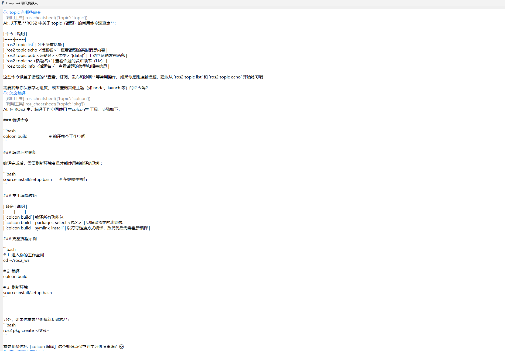

# DeepSeek ROS 学习助手

基于 DeepSeek API 的 ROS 学习助手，支持多轮对话与工具调用。

## 项目介绍

本项目是一个面向 ROS / ROS2 学习者的智能问答助手。它接入 DeepSeek 大语言模型 API，通过 Function Calling 让模型自主调用天气查询、数学计算、本地文件读取、学习进度记忆、ROS2 命令速查等工具，帮助你在学习 ROS 的过程中快速解决疑问、记录进度、查阅常用命令。

项目同时提供命令行版（`chatbot.py`）与 GUI 聊天界面版（`gui.py`），两者共用同一套工具注册表与对话逻辑。

## 功能列表

- **多轮对话**：基于 DeepSeek `deepseek-chat` 模型，流式输出回复，自动维护上下文历史（默认保留最近 10 轮）。
- **工具调用（Function Calling）**：
  - **查天气**：`get_weather` — 调用 wttr.in 实时查询任意城市天气（免费、无需 Key）。
  - **计算**：`calculate` — 计算数学表达式，仅允许数字与运算符，防止注入。
  - **读文件**：`read_local_file` — 读取本地文本文件内容（UTF-8 / GBK 自动适配，限制 200KB / 5000 字符）。
  - **学习进度记忆**：`save_progress` / `get_progress` — 保存/查询学习进度，数据持久化到本地 JSON 文件（`progress.json`），重启不丢。
  - **ROS2 命令速查**：`ros_cheatsheet` — 按主题查询 `topic / node / launch / pkg / run / colcon / param / service` 常用命令。
  - **知识库检索**：`kb_search` — 在 ROS2 21讲知识库（图文教程 + 配套代码，`kb/` 目录）中检索概念、原理、代码示例。
  - **本地语义检索（可选）**：`rag.py` — 用本地向量模型把知识库切成小块做向量化，支持按语义相似度检索，比关键词检索更能理解"换种说法"的问题（详情见下文）。
- **GUI 聊天界面**：基于 Python 自带 tkinter，支持打字机流式输出、工具调用日志展示、清空对话，无需额外安装依赖。

## 技术栈

- **Python 3**（标准库 + `openai` SDK）
- **DeepSeek API**（`https://api.deepseek.com`，模型 `deepseek-chat`，可选 `deepseek-reasoner`）
- **Function Calling**（`tools` 参数声明工具，流式解析工具调用并回填历史）
- **本地向量检索（可选）**：`fastembed` + BGE-small-zh-v1.5 中文向量模型（512 维，余弦相似度），仅 `rag.py` 使用
- **JSON 存储**（学习进度持久化到 `progress.json`）

## 快速开始

### 1. 环境准备

```bash
# 创建虚拟环境（Windows）
python -m venv .venv

# 激活虚拟环境
.\.venv\Scripts\activate

# 安装依赖（openai + 知识库构建脚本依赖）
pip install -r requirements.txt
```

### 2. 配置 API Key

在项目根目录创建 `.env` 文件，内容为：

```
DEEPSEEK_API_KEY=sk-你的key
```

> 注意：文件名必须是 `.env`（不是 `.env.txt`），等号两边不要有空格。程序会自动读取 `.env`，也支持通过系统环境变量设置 `DEEPSEEK_API_KEY`。`.env` 已被 `.gitignore` 忽略，不会上传到仓库。

### 3. 运行命令行版

```bash
python chatbot.py
```

输入 `exit` / `quit` / `退出` 结束对话，`Ctrl+C` 或 `Ctrl+D` 也可退出。

### 4. 运行 GUI 版

```bash
python gui.py
```

GUI 版使用 Python 自带的 tkinter，无需额外安装依赖，支持流式打字机效果与工具调用日志展示。

### 5. 使用 start.bat 一键启动

双击项目根目录的 `start.bat` 即可直接启动命令行版（需已配置好 `.venv` 与 `.env`）。脚本会自动激活虚拟环境并运行 `chatbot.py`，对话结束后按任意键关闭窗口。

## 知识库（ROS2 21讲）

项目内置古月居《ROS2入门21讲》知识库，供 `kb_search` 工具检索（概念、原理、命令用法、代码示例）。

- **内容**：`kb/docs/`（23 个图文教程章节）+ `kb/code/`（21 个配套代码章节）
- **构建**：`kb/` 已被 `.gitignore` 忽略，首次使用请运行（依赖已在 `requirements.txt` 中）：
  ```bash
  python build_kb.py                     # 爬取图文教程 + 解析代码仓库，生成 kb/
  ```
- **使用**：对话中问 ROS2 概念/原理/代码示例时，模型会自动调用 `kb_search` 检索相关章节再回答，无需手动干预。
- **注意**：知识库素材版权归古月居（武汉精锋微控科技有限公司）所有，本仓库仅包含构建脚本，不含知识库正文；如需使用教程内容请访问 book.guyuehome.com 获取授权。

## 本地语义检索（rag.py，可选）

`kb_search` 是关键词/词频检索，适合"查命令、查名词"；如果想问"换个说法"也能命中（比如搜『ROS2里怎么创建一个发布节点』），可以用 `rag.py` 做语义检索——它对理解类问题更友好。

- **原理**：复用 `kb_search.py` 的切块逻辑把 `kb/` 内容切成小块 → 本地模型 `BAAI/bge-small-zh-v1.5` 转成 512 维向量 → 和你的问题算余弦相似度，返回最像的 Top-K（低于阈值 `SIM_THRESHOLD` 的结果会丢弃，避免硬答）。
- **依赖安装**（可选，只影响本脚本）：
  ```bash
  pip install -r requirements.txt   # 含 fastembed + numpy
  ```
- **首次运行**：会自动把向量模型下载/缓存到项目内 `kb/_models/`（不在系统临时目录，清临时文件不丢）；语料没变时向量缓存存 `kb/_rag_cache.pkl`，二次查询秒回。
- **用法**：
  ```bash
  python rag.py "ROS2里怎么创建一个发布节点"
  ```
  国内网络下首次下载模型若超时，脚本已默认走 `hf-mirror.com` 镜像。
- **可调参数**（`rag.py` 顶部配置区）：`SIM_THRESHOLD`（相似度阈值，默认 0.55，调高更严格、调低更宽松）、`SPLIT_VERSION`（改过切块/向量化逻辑记得 +1，旧缓存自动作废）。

## 效果验证（个人实测）

以下数据来自个人本地小规模实测，**样本与测试条件有限，不是大规模基准评测**，仅供了解实际效果参考。

- **知识库规模**：古月居《ROS2入门21讲》构建后共 **970 个知识块**（图文教程 + 配套代码；块数随构建结果可能变化）。
- **检索方案**：`fastembed` + `BAAI/bge-small-zh-v1.5`（512 维中文向量），余弦相似度 **Top-3** 召回；低于 `SIM_THRESHOLD`（0.55）的结果直接丢弃，知识库无相关内容时宁可拒答，不硬凑答案。
- **阈值实测（本地小样本）**：相关问题相似度最低 **0.583**，无关问题最高 **0.516**——因此取 0.55 作为阈值，能在该样本下把"相关"与"无关"问题分开。
- **测试条件与局限**：本地人工抽样测试，问题数量有限，未做交叉验证或大规模基准；换一批问法时相似度分布会波动，**贴近阈值的边界问题仍可能误召回或漏召回**，阈值本身是经验值而非最优解。

复现单个问题：

```bash
python rag.py "ROS2里怎么创建一个发布节点"
```

## 运行截图



## 项目结构

```
chatbot/
├── chatbot.py      # 命令行版主程序（多轮对话 + 工具调用循环）
├── gui.py          # GUI 版聊天界面（tkinter）
├── tools.py        # 工具函数实现与注册表（TOOL_MAP）
├── schema.py       # 工具声明 Schema（TOOLS），与 tools.py 一一对应
├── kb_search.py    # 知识库检索工具（kb_search 的实现，检索 kb/ 目录）
├── rag.py          # 本地语义检索脚本（可选，向量化 kb/ 后按语义相似度检索）
├── build_kb.py     # 知识库构建脚本（爬取图文教程 + 解析代码仓库，生成 kb/）
├── requirements.txt # 依赖清单（openai + 构建脚本依赖）
├── start.bat       # Windows 一键启动脚本
├── kb/             # 知识库内容（运行时生成，已被 .gitignore 忽略）
├── progress.json   # 学习进度存储文件（运行时生成，已被 .gitignore 忽略）
├── .env            # API Key 配置文件（需自行创建，已被 .gitignore 忽略）
└── docs/
    └── screenshot_gui.png  # 运行截图
```

## 目录说明

| 文件 | 作用 |
| --- | --- |
| `chatbot.py` | 命令行版主程序：加载 `.env`、流式调用 DeepSeek API、执行工具调用循环 |
| `gui.py` | GUI 版聊天界面：后台线程跑对话逻辑，消息队列驱动界面刷新 |
| `tools.py` | 7 个工具函数的实现与 `TOOL_MAP` 注册表 |
| `schema.py` | 工具调用声明（Function Calling 的 `tools` 参数），供模型识别 |
| `start.bat` | 一键启动脚本：激活虚拟环境并运行 `chatbot.py` |
| `kb_search.py` | 知识库检索工具：在 `kb/` 中检索 ROS2 教程内容（轻量词频检索，零依赖） |
| `rag.py` | 本地语义检索脚本：复用 `kb_search.py` 切块，向量化后按余弦相似度检索（可选依赖 fastembed） |
| `build_kb.py` | 知识库构建脚本：爬取古月居图文教程 + 解析 21 讲代码仓库，生成 `kb/` |
| `.gitignore` | 忽略 `.env`、`.venv`、缓存与运行时数据等敏感/临时文件 |

## 添加新工具

按 `tools.py` 顶部注释的三步走：

1. 在 `tools.py` 中编写普通 Python 函数；
2. 在 `schema.py` 中声明该工具的调用说明（名称、描述、参数）；
3. 在 `tools.py` 的 `TOOL_MAP` 中登记「工具名 -> 函数」。

## 运行测试

项目自带单元测试，使用 Python 标准库 `unittest`，**无需额外安装依赖**：

```bash
python -m unittest discover -s tests -v
```

- **用例数**：当前共 **31 个**用例（可用 `python -c "import unittest; print(unittest.defaultTestLoader.discover('tests').countTestCases())"` 实测收集确认）。
- **覆盖范围**：
  - **工具函数**（`tools.py`）：`calculate` 表达式与非法字符校验；`read_local_file` 的敏感路径拦截、目录/不存在、大小限制与自动截断、UTF-8 编码；`save_progress` / `get_progress` 的 JSON 读写（测试内已把 `PROGRESS_FILE` 指向临时文件，不会污染真实进度）；`ros_cheatsheet` 中英文关键词匹配；`get_weather`（mock 网络，不真实联网）；
  - **知识库检索**（`kb_search.py`）：分词、按标题切块、空查询与知识库缺失时的兜底提示；
  - **历史裁剪与工具调用配对**（`chatbot.py`）：`trim_history` 在字符预算裁剪后，`assistant(tool_calls) -> tool` 的配对不被拆散（回归 06148b1 引入裁剪后出现过的孤儿 `tool` 消息导致 API 400 的问题）。

## 许可证

本项目源代码采用 [MIT License](LICENSE) 授权，版权归 HSBW6（Copyright (c) 2026 HSBW6），详见仓库根目录 [LICENSE](LICENSE) 文件。

知识库素材（`kb/`，含古月居图文教程与配套代码）版权归古月居（武汉精锋微控科技有限公司）所有，需另行获取授权后方可使用；其版权声明与项目自身的 MIT 许可证相互独立，不随 MIT 许可一并授权。

## 免责声明

1. 本项目的天气数据来自免费公开服务 [wttr.in](https://wttr.in)，仅供学习参考，不保证实时准确。
2. 知识库（`kb/`）素材版权归古月居所有，仅限个人学习使用，请勿公开分发或商用；教程内容基于特定 ROS 版本（Humble/Foxy），可能存在版本差异，请以官方文档为准。
